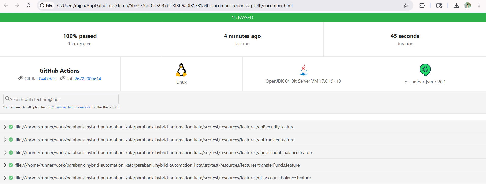

# ParaBank Hybrid Automation Kata

This project is a hybrid automation framework for ParaBank. It uses Selenium WebDriver for UI tests, REST Assured for API tests, Cucumber for BDD scenarios, and TestNG for execution and assertions.

## Prerequisites

- Java 17
- Maven 3.x
- Google Chrome browser for UI tests
- Git

Verify the tools before running the tests:

bash
java -version
mvn -version
git --version

The framework follows common automation design patterns and practices:

- Page Object Model (POM)
- Cucumber BDD
- Selenium WebDriver
- REST Assured
- TestNG
- Maven
- GitHub Actions CI/CD

## Tech Stack

| Component | Technology |
| --- | --- |
| Language | Java |
| UI Automation | Selenium WebDriver |
| API Automation | REST Assured |
| BDD | Cucumber |
| Test Runner | TestNG |
| Build Tool | Maven |
| Version Control | Git |
| CI/CD | GitHub Actions |

## Project Structure

```text
src/
  main/
    java/
    resources/
  test/
    java/
    resources/
```

## Clone the Repository

bash
git clone https://github.com/Nandhini202325/parabank-hybrid-automation-kata.git

cd parabank-hybrid-automation-kata


## Configuration

The main runtime configuration is available in:

src/main/resources/config.properties


Default values:


ui.base.url=https://parabank.parasoft.com/parabank

api.base.url=https://parabank.parasoft.com/parabank/services/bank

browser=chrome

headless=false


For CI or headless execution, pass:

bash
mvn clean test -Dheadless=true


## Run Tests

Run the complete suite:

bash
mvn clean test


Run only API scenarios:

bash
mvn clean test -Dcucumber.filter.tags="@api"


Run only UI scenarios:

bash
mvn clean test -Dcucumber.filter.tags="@ui"


Run regression scenarios:

bash
mvn clean test -Dcucumber.filter.tags="@regression"


## Test Reports

After execution, reports are generated under:


target/cucumber-reports/cucumber.html

target/cucumber-reports/cucumber.json

target/cucumber-reports/cucumber.xml

target/surefire-reports/index.html

target/surefire-reports/emailable-report.html


For separate API and UI evidence, run the API and UI commands separately and save each generated report before running the next command, because the default report files are overwritten on each Maven run.

Suggested report names for submission:


API report: target/cucumber-reports/cucumber.html after running -Dcucumber.filter.tags="@api"

UI report: target/cucumber-reports/cucumber.html after running -Dcucumber.filter.tags="@ui"

Sample Report




Failure screenshots for UI scenarios are saved under:


target/screenshots


## CI

GitHub Actions is configured in:

.github/workflows/ci.yml


The workflow runs Maven tests with Java 17 and uploads Cucumber reports, Surefire reports, and failure screenshots as artifacts.
 
